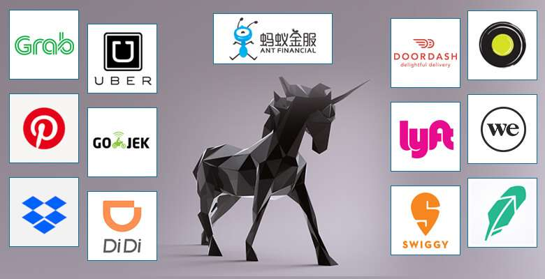
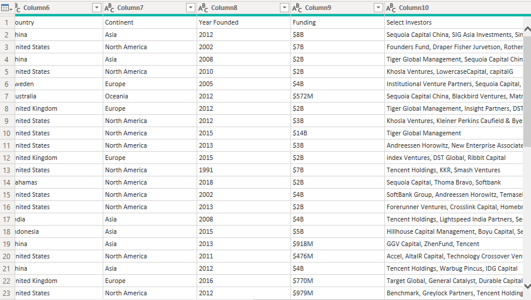

# Unicorn Companies

## Introduction 

According to google, **Unicorn companies** are those that reach a valuation of **$1 billion** without being listed on the stock market. This means that has its valuation equal to or greater than One Billion Dollars. It may take a few years or might take more than 50 years. This dataset gotten from Maven.com shows more than a thousand companies with their location (city and country), present valuation in dollars, seed capital (Total amount raised across all funding rounds to start the business), date when the company was founded and when it attained Unicorn and so on. The data was a bit messy but I cleaned it up, added some columns and transform some columns on the table 
**_Disclaimer_**: _All datasetand reports do not represent any company, institution or country_

## Problem statement

•	Which unicorn companies have had the biggest return on investment?

•	How long does it usually take for a company to become a unicorn? Has it always been this way?

•	Which countries have the most unicorns? Are there any cities that appear to be industry hubs?

•	Which investors have funded the most unicorns?

## Skills / Concept Demostrated

the following Power Bi features were incorporated:
- Bookmarking
- DAX,
- Quick measures,
- Modelling,
- filters,
- Group and Unpivot column,
- Button etc.

  ## Modelling

  The cardinality of the two table is many to many

  

## Data sourcing

I downloaded the unicorn company csv file on the Maven website and then extracted it into Power Bi for cleaning, analysis and visualization.
It contains only one table but I referenced the table for analysis

## Data transformation / cleaning
Data was efficiently cleaned and transformed with Power Query Editor of Power BI. Some of the applied steps include
•	Creating new columns to store extract the year each company joined unicorn list in order for me to be able to calculate the year it takes to join the list 
Year founded – Year joined = duration it takes to achieve unicorn

  
  
•	Also, a column was conditional formatted to give either after millennium or before millennium. Companies founded on or before 1999 was assigned before millennium while companies founded after 1990 are assigned after millennium. This was done to show disparity between companies founded before and after internet

 

•	I adjusted all value types of most columns and also write all currency figures in full
•	I referenced the Unicorn_companies table to give me exact replica of my table so as to analyse all investors that was merged together.

merged investors column            |      sorted ivestor column          
:---------------------------------:|:---------------------------------:
                   |                                               

## Data analysis and visuals

The data was visualized with the aid of a slicer which divided the values gotten to before and after the millennium. Reasons for this is to understand the importance of what the internet has done to industrialization. Even though the official birthday of the internet is in 1983, it took off after the millennium because of the rapid rise of mobile phones which subsequently increase production thereby fastening the rate of production and adoption.

•	The Unicorn Company with the highest return on investment is Zapier. Zapier is an internet software and services company based in Sunnyvale, United states. It was founded in 2011 with just 1 million raised as capital. After 10 years it made its first one billion dollars and the company is now worth 4 billion dollars. Its return of investment which was calculated with the formula below is almost 40. 

                                    (Valuation – funding) / funding

                                    
This means Zapier is now worth more than 4000% of its investment capital.
-	For a company to be regarded as a unicorn company it must make a billion dollars. From the analysis, it takes just 7 years for companies founded after the millennium to make the unicorn list while it takes more than 25 years for companies founded before millennium. 
-	The united states appear to have the most companies on the unicorn list with over 550 companies followed by China and India with 173 and 65 companies respectively. Companies in the United States on the unicorn list after the millennium increased more than 1000% from just 6 companies to more than 560 companies. The city with the most unicorn company is San Francisco with 152 companies. Safe to say San Francisco is an industrial hub of the world.
-	When I got to this point while transforming my data in Power Query, I had to reference my table. I referenced it in order to continue my transformation with affecting my columns and also to separate the investors in the Select Investors column. Accel seem to the most profited investor. The investor funded about 60 companies. 

Before Millenium visuals           |      After Millenium visuals          
:---------------------------------:|:---------------------------------:
         |                                               

**_You can interact with the report [here](https://app.powerbi.com/view?r=eyJrIjoiNTk4ZTExYjgtZjc5ZC00NWJlLTllZmItM2UyZGJkMjIxZDkzIiwidCI6ImEwYWExMjgzLWZkMjMtNGVmMS05Yjk4LTkzMWE5YTkyYjVlOSJ9)_**
 
## Conclusion and recommendation 

- The investor with the most funded company, Accel, funded about 33 companies in the United States, followed by India and United Kingdom.  United States accounted for 55.00% of Count of Company.  Across all 15 Country, Count of Company ranged from 1 to 33.  
-	Zapair company is the most profitable company in the last hundred years. this company has made more than 3500% of its initial capital. This may be due to the rapid increase in software based services.
-	It took 98 years for Otto Boch Healthcare to attain unicorn while it just took Orca Security Company 2 years.
-	Count of Company was highest for United States at 562, followed by China and India.  United States accounted for 57.82% of Count of Company.  Across all 11 Country, Count of Company ranged from 12 to 562.  
